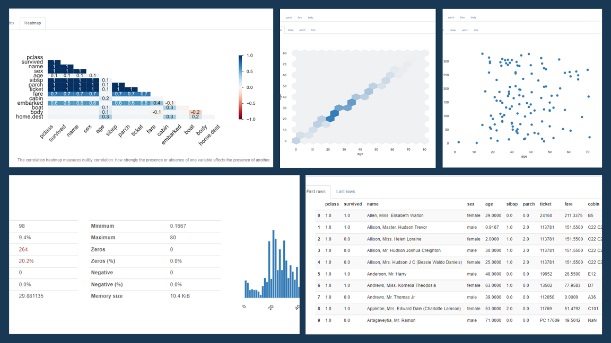

# Exploratory Data Analysis Using Pandas Profiling (ydata profiling)




## Table of Contents
- [Project Overview](#project-overview)
- [Installation](#installation)
- [Contributing](#contributing)


## Project Overview

This Python code utilizes Pandas and Pandas Profiling libraries to explore and analyze the Titanic passenger dataset.


## Installation

1. Clone the repository to your local machine:
   
   ```bash
   git clone https://github.com/ashwani-kushwah/eda-uasing-pandas-profiling.git
   ```
2. Install the required Python packages using pip:
   
    ```bash
    pip install pandas
    ```
    ```bash
    pip install pandas-profiling
    ```

<br>

## Contributing

Contributions are welcome! If you have ideas for improvements or want to add more questions, please follow these steps:
1. Fork the repository.
2. Create a new branch for your feature: `git checkout -b feature-new-question`
3. Commit your changes: `git commit -m 'Add a new question'`
4. Push to the branch: `git push origin feature-new-question`
5. Submit a pull request.
